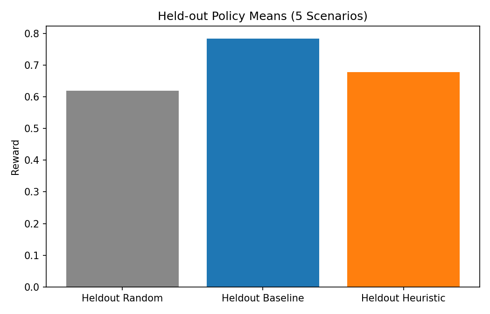
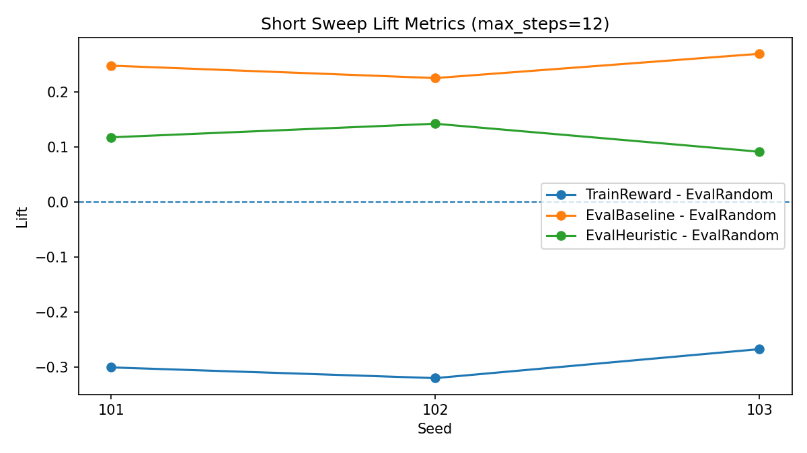
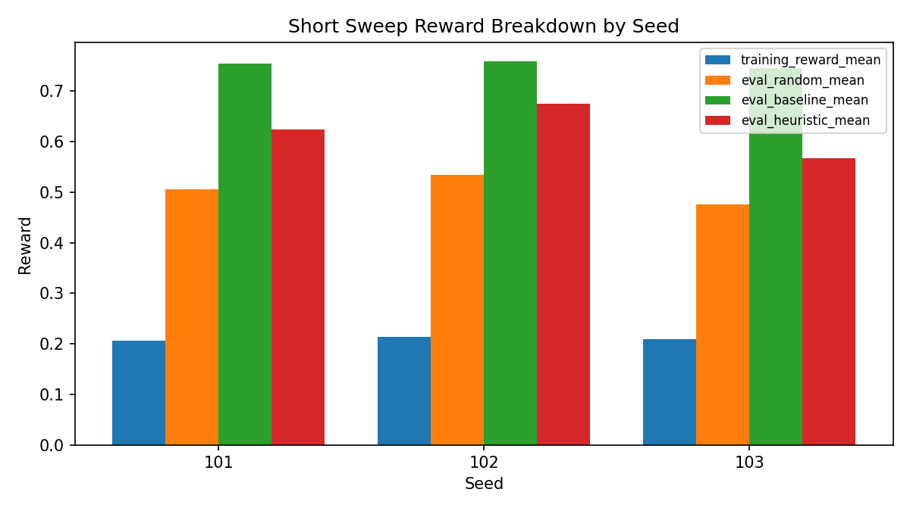

# NeuralTuner: An RL Environment for Hardware-Aware Neural Network Optimization on Snapdragon

> *Teaching an LLM to think like a AI Model optimization engineer — one layer at a time.*

**[🤗 Live Demo — HuggingFace Space](https://huggingface.co/spaces/Mohammed-Altaf/Neural-Tuner)** | **Google Collab Notebook** [Notebook](https://colab.research.google.com/drive/1cGnFxloW-3WN_I5imlkjGcWJVzZnLbcq?usp=sharing) | **W&B Results** [Logs](https://api.wandb.ai/links/mohammedaltaf4316/4czj329l)
---

## The Problem: Manual Model Optimization Is a Bottleneck at Scale

Deploying a neural network to a Qualcomm Snapdragon-powered device — a smartphone, an ADAS ECU, a laptop NPU, an XR headset — is not as simple as exporting a PyTorch model. Every production deployment goes through a hardware-specific optimization pipeline that today relies heavily on expert engineers.

The workflow looks roughly like this:

1. **Profile each layer** to understand its contribution to latency, memory, and its sensitivity to precision reduction.
2. **Decide per-layer quantization** — should this layer stay at FP32, drop to FP16, or be aggressively quantized to INT8 or INT4?
3. **Apply structured pruning** — can we remove entire channels/filters to exploit the Snapdragon HTP's sparse-acceleration hardware?
4. **Validate hardware constraints** — does the resulting model fit within the device's latency budget, memory envelope, and accuracy floor?
5. **Iterate** — if constraints aren't met, revisit decisions and try again.

This cycle is done manually today. For a 50-layer network with 4 quantization options and 4 pruning options per layer, the decision space is **8^50 ≈ 10^45 combinations**. Engineers use intuition and years of hardware experience to navigate this. It takes days to weeks per model, and every new device or model family requires it again from scratch.

**NeuralTuner converts this expert-intensive workflow into a structured RL environment** where a language model learns to act as the optimization engineer — profiling layers, making quantization decisions, validating constraints, and iterating until it finds a configuration that meets all hardware requirements.

---

## Why Snapdragon HTP?

The **Snapdragon HTP (Hexagon Tensor Processor)** is Qualcomm's dedicated AI accelerator present across the Snapdragon 8 Gen series (mobile), Snapdragon X Elite (compute), Snapdragon Ride (automotive), and Snapdragon XR platforms. It has specific hardware support for:

- **INT8 and INT4 computation** — dramatically lower latency than FP32 due to packed SIMD operations
- **Sparse weight acceleration** — hardware-native support for structured pruning; 50% and 75% sparsity maps directly to hardware-accelerated sparse matrix operations
- **Strict memory envelopes** — edge devices have no dynamic memory expansion; models that exceed the budget simply cannot run

Quantization and pruning effects are **not independent**. On HTP hardware, they **stack multiplicatively** on latency and memory — a layer quantized to INT4 and pruned at MEDIUM sparsity (50% channels removed) achieves roughly `0.28 × 0.65 ≈ 18% of baseline latency`. Accuracy penalties, however, **add** rather than multiply — reflecting that both operations independently erode model precision. NeuralTuner's simulator faithfully models both of these hardware behaviors.

---

## Why Reinforcement Learning? (And Why Not the Obvious Alternatives)

This is an optimization problem, so the obvious question is: why not use a classical optimizer?

**Why not grid search or random search?**  
The decision space is `8^N` where `N` is number of layers (`4` quantization dtypes x `4` pruning levels). At 10 layers this is about `10^9` plans; at 50 layers it is about `10^45`. Even one plan evaluation is a full simulator pass, so exhaustive or broad sampling strategies are not practical at production scale.

**Why not Bayesian optimization?**  
Bayesian optimization is strongest in low-dimensional continuous settings. Here the space is high-dimensional and categorical, with sharp discontinuities (one bad decision on a high-sensitivity layer can dominate final reward). It also tends to optimize one fixed setup at a time, while we need a strategy that transfers across multiple models and constraint profiles.

**Why not supervised learning?**  
Supervised learning needs labels of the form `(model, constraints) -> optimal plan`. In this setting there is no authoritative optimal label dataset; even the oracle ceiling is a heuristic reference, not a certified optimum. The available supervision is reward from environment interaction.

**Why RL fits this task**
- **Partial observability**: sensitivity is hidden until `profile_layer`, so information gathering is part of the policy.
- **Sequential decision making**: reward depends on a sequence of tool calls, not one static prediction.
- **Delayed credit assignment**: final quality is determined at `submit()`, with intermediate shaping to guide learning.
- **Policy transfer**: the model learns a strategy (profile -> decide -> validate), not a single static configuration.

---

## Environment Design

**OpenEnv-compatible FastAPI server** with a stateful, multi-step RL episode interface to any LLM agent.

### MDP Formalization

NeuralTuner is a finite-horizon, episodic **Partially Observable MDP (POMDP)**.

| Component | Definition |
|-----------|------------|
| **State (S)** | Full environment state: layer profiles (including hidden sensitivities), quant/prune assignments, profiled set, step counters, benchmark counters |
| **Observation (O)** | Visible state returned to the agent; sensitivities are hidden until `profile_layer()` so `O` is a strict subset of `S` |
| **Action (A)** | `{profile_layer, quantize_layer, prune_layer, revert_layer, benchmark, submit}` plus arguments |
| **Reward (R)** | Episodic reward in `[0, 1]` at `submit()` with shaped intermediate signals during training |
| **Discount gamma** | `1.0` (episodic, undiscounted objective) |
| **Horizon (H)** | Max 20 steps per episode, benchmark budget capped at 5 |
| **Policy (π)** | LLM tool-calling policy (Qwen/DeepSeek family) optimized via GRPO |

The `O ⊂ S` gap (hidden sensitivity until profiling) is the key design choice that *forces exploration before exploitation.*

### System Architecture

```
┌──────────────────────────────────────────────────────────────┐
│                     NeuralTuner Runtime                      │
│                                                              │
│  ┌─────────────────┐   tool_call JSON   ┌────────────────┐   │
│  │    LLM Agent    │ ◄────────────────► │  FastAPI Env   │   │
│  │ (policy π)      │   observation text │  Server        │   │
│  └─────────────────┘                    └───────┬────────┘   │
│                                                 │            │
│                              ┌──────────────────┼─────────┐  │
│                              │                  │         │  │
│                     ┌────────▼──────┐  ┌────────▼──────┐  │  |
│                     │   Hardware    │  │   Scenario    │  │  |
│                     │   Simulator   │  │   Registry    │  │  |
│                     │ (lat/mem/acc) │  │ (19 scenarios)│  │  |
│                     └───────────────┘  └───────────────┘  │  |
└──────────────────────────────────────────────────────────────┘
```

At each `step()`, the environment applies the action to scenario state, calls the simulator for latency/memory/accuracy effects, and returns updated observation text and reward metadata.

With the problem setting and RL rationale defined, the next sections detail exactly what the agent sees, what it can do, and how outcomes are scored.

### State Space

At episode start (`reset()`), the agent observes:
- The **model identity** (e.g., ResNet-50) and total parameter count
- The **layer table** — each layer's ID, type, baseline latency (ms), and baseline memory (MB)
- The **Snapdragon HTP constraints** — a hard latency budget, a hard memory budget, and a minimum accuracy retention threshold
- The **scenario description** — a natural-language framing of the deployment context (e.g., "ResNet-50 in an edge inference pipeline with strict memory budget")

Crucially, **layer sensitivity scores are hidden** at episode start. This is a deliberate design choice — it mirrors real hardware profiling workflows (you don't know a layer's sensitivity until you run a calibrated profiling pass) and it forces the agent to develop an information-gathering strategy before making quantization decisions.

### Action Space

The agent has six discrete tool-call actions:

| Action | Arguments | Effect |
|--------|-----------|--------|
| `profile_layer(layer_id)` | layer ID | Reveals sensitivity score (0–1), quantization advice, pruning advice |
| `quantize_layer(layer_id, dtype)` | layer ID + `FP32`/`FP16`/`INT8`/`INT4` | Applies quantization dtype to one layer |
| `prune_layer(layer_id, sparsity)` | layer ID + `LOW`/`MEDIUM`/`HIGH` | Removes 25%/50%/75% of channels (structured pruning) |
| `revert_layer(layer_id)` | layer ID | Resets layer to FP32, no pruning |
| `benchmark()` | — | Runs the hardware simulator; returns latency, memory, accuracy, projected reward |
| `submit()` | — | Finalises the episode; returns the true final reward |

The **benchmark action is rate-limited to 5 calls per episode**. This prevents a degenerate strategy of single-step quantize → benchmark → revert loops and forces the agent to batch decisions and plan ahead — as an engineer would.

### Partial Observability and the Profiling Incentive

The hidden sensitivity design creates a **partially observable MDP**. The agent must decide how many steps to invest in information gathering (`profile_layer`) before committing to compression decisions. Profiling too little risks over-aggressive quantization that destroys accuracy. Profiling everything costs steps that could be used for optimization.

The environment explicitly rewards the profile-first strategy through its reward shaping (detailed below) and by emitting a `WARNING: Layer not profiled` message when the agent quantizes a layer it has not yet profiled — training signal that unprofiled quantization is risky.

### Simulator: Calibrated Hardware Model

`server/simulator.py` implements the hardware model. For each layer, it applies:

```
latency(layer) = base_latency × dtype_latency_factor × prune_latency_factor
memory(layer)  = base_memory  × dtype_memory_factor  × prune_memory_factor
accuracy_penalty(layer) = sensitivity × (dtype_acc_penalty + prune_acc_penalty)
```

The factor tables are calibrated against real Snapdragon HTP profiling data:

| dtype | Latency factor | Memory factor | Acc penalty/sensitivity |
|-------|---------------|--------------|------------------------|
| FP32  | 1.00 | 1.000 | 0.0 |
| FP16  | 0.62 | 0.500 | 0.30 |
| INT8  | 0.42 | 0.250 | 2.0 |
| INT4  | 0.28 | 0.125 | 7.0 |

| Pruning | Latency factor | Memory factor | Acc penalty/sensitivity |
|---------|---------------|--------------|------------------------|
| NONE    | 1.00 | 1.00 | 0.0 |
| LOW     | 0.82 | 0.75 | 0.8 |
| MEDIUM  | 0.65 | 0.50 | 2.5 |
| HIGH    | 0.45 | 0.25 | 6.0 |

Total accuracy retention is computed as:
```
accuracy_retention = clip(1.0 - Σ(layer_penalty) / 100.0, 0.0, 1.0)
```

### Reward Function

The multi-component reward is designed to prevent reward hacking while producing a dense, informative gradient signal:

```
reward = latency_reward + memory_reward + accuracy_reward + efficiency_bonus
```

| Component | Range | Logic |
|-----------|-------|-------|
| Latency improvement | 0.00 – 0.40 | Continuous — proportional to % latency saved vs FP32 baseline |
| Memory constraint | 0.00 or 0.30 | Binary — model must fit within device memory budget |
| Accuracy retention | 0.00 – 0.20 | Continuous — scaled within [min_accuracy, 1.0] range |
| Efficiency bonus | 0.00 or 0.10 | All three constraints met simultaneously |

**Why this structure prevents reward hacking:**
- Blindly applying INT4 to all layers collapses accuracy → accuracy_reward = 0, efficiency_bonus = 0. Total ≈ 0.10.
- Leaving all layers at FP32 gives zero latency improvement → latency_reward = 0. Total ≈ 0.50 (memory fits, accuracy perfect).
- The optimal strategy — selective mixed-precision based on sensitivity — is the only path to reward > 0.80.

#### Intermediate Reward Shaping (Training Only)

The `submit()` reward is sparse — it arrives only at the last step of a 20-step episode. Sparse terminal reward makes credit assignment hard: which of the 20 actions caused the good outcome? To guide learning, the TRL training wrapper (`scripts/neural_tuner.py`) applies intermediate shaping that accumulates across the episode and is added to the GRPO reward signal.

| Shaping signal | Amount | Purpose |
|---------------|--------|---------|
| Profile a new layer | +0.005 | Reward information gathering |
| Re-profile the same layer | −0.005 | Penalize redundant profiling |
| Quantize/prune a layer you just profiled | +0.008 | Reward the profile → decide sequence |
| Quantize/prune without prior profiling | +0.002 | Allow but don't reward blind decisions |
| Benchmark after a quantization change | +0.004 | Reward validate-your-work behaviour |
| Benchmark with no state change (spam) | −0.010 | Penalize benchmark without acting |
| Exact same action twice in a row | −0.010 | Penalize action loops |
| Benchmark delta: latency improved | +0.05 × Δlatency | Reward measurable progress |
| Benchmark delta: accuracy dropped | −0.004 | Penalize accuracy regressions |

These signals are clamped to ±0.03 per benchmark call and reset to zero after each `submit()`. They are added on top of the terminal reward during GRPO training but are invisible to the inference policy — the trained model learns to follow the profile-first strategy because it received denser gradient signal during training, not because it sees shaping at inference time.

This is a standard practice in reward engineering: shape during training to solve the credit assignment problem, evaluate on the unmodified terminal reward only.

### Scenarios: 19 Deployment Challenges

The environment includes 19 scenarios across 5 models and 3 difficulty tiers, each modelling a real-world Snapdragon deployment target:

| Model | Params | Baseline | Domain |
|-------|--------|----------|--------|
| Inception V3 | 47M | 175 ms, 186 MB | Mobile vision analytics |
| ResNet-50 | 25M | 88 ms, 93 MB | ADAS feature backbone |
| MobileNet V3 | 5.4M | 24 ms, 21 MB | IoT / always-on edge |
| GM Perception Net | 58M | 210 ms, 232 MB | Automotive object detection |
| BMW DriveNet | 35M | 145 ms, 140 MB | Autonomous segmentation + depth |

Difficulty scaling:

| Tier | Latency target | Memory target | Min accuracy | Challenge |
|------|---------------|--------------|-------------|-----------|
| Easy | ≤60% baseline | ≤60% baseline | ≥0.85 | Uniform INT8 sufficient |
| Medium | ≤45–50% baseline | ≤45–52% baseline | ≥0.88–0.93 | INT4 required on select layers; protect heads |
| Hard | ≤38–42% baseline | ≤28–40% baseline | ≥0.90–0.95 | Strict mixed-precision; some variants RAM-primary, others accuracy-primary |

---

## Key Technical Terms

### Sensitivity Score
A per-layer float in [0.0, 1.0] that quantifies how much that layer's output degrades when its precision is reduced. Low-sensitivity layers (e.g., early convolutional stems, pooling) tolerate aggressive INT4 quantization with minimal accuracy loss. High-sensitivity layers (classifiers, detection heads, output predictors) degrade rapidly under precision reduction and typically must stay at FP16 or FP32.

Sensitivity scores are **hidden from the agent at episode start** — they must be revealed layer-by-layer using `profile_layer()`. This is the core information asymmetry that makes the task non-trivial.

### Oracle Ceiling
The best reward achievable by a strong reference policy that knows all layer sensitivities in advance and makes near-optimal quantization decisions for this setup. For the inception_v3 medium scenario used in training diagnostics: **oracle ceiling = 0.6428**. This is computed offline by running a heuristic policy (profile all → assign dtype by sensitivity threshold → benchmark → submit). The oracle is not the theoretical maximum reward of 1.0; it is a practical upper bound for this environment configuration.

### Random Baseline
The mean reward of a random policy (random action type, random layer, random dtype) averaged over 20 seeds. For inception_v3 medium: **random baseline = 0.4650**. This value is not near zero because the reward has non-zero floor components (especially memory satisfaction in many trajectories) and random compression can still yield partial latency gains.

### Lift vs Random / Lift vs Oracle
Two derived metrics used to track training progress:
- **Lift vs Random** = eval_reward − random_baseline (how much better than random)
- **Lift vs Oracle** = (eval_reward − random_baseline) / (oracle_ceiling − random_baseline) (% progress from random to oracle)

### Structured Pruning
A compression technique that removes entire channels or filters from convolutional layers (as opposed to unstructured pruning which zeros individual weights). Structured pruning produces dense weight matrices with fewer channels, enabling direct speedup without sparse-format overhead. The Snapdragon HTP has dedicated hardware for sparse workloads — structured pruning at MEDIUM (50%) or HIGH (75%) sparsity maps directly to accelerated execution paths on-chip.

---

## What the Agent Must Learn: Random vs Expert Episode Traces

The trained agent's target behavior — the strategy that earns high reward — is clearly visible by comparing a random agent to a heuristic agent on the same scenario:

### Random Agent (reward: 0.30)
```
Step 1:  quantize_layer(conv_stem, FP32)   → WARNING: Layer not profiled
Step 2:  quantize_layer(conv_bn_1, FP32)   → WARNING: Layer not profiled
Step 3:  quantize_layer(mixed_3a, INT8)    → WARNING: Layer not profiled
...
Step 11: benchmark()
Step 12: submit()                          → reward = 0.3037, constraints_met = False
```

The random agent never profiles. It applies dtypes without knowledge of sensitivity, frequently leaves high-sensitivity layers under-protected and low-sensitivity layers under-compressed simultaneously.

### Heuristic Agent (representative trace)
```
Step 1:  profile_layer(conv_stem)          → sensitivity=0.040 [low risk — INT4 safe]
Step 2:  profile_layer(conv_bn_1)          → sensitivity=0.020 [low risk — INT4 safe]
Step 3:  profile_layer(mixed_3a)           → sensitivity=0.080 [low risk]
Step 4:  profile_layer(mixed_4a)           → sensitivity=0.120 [medium risk — INT8 preferred]
Step 5:  profile_layer(mixed_5a)           → sensitivity=0.090 [low risk]
Step 6:  profile_layer(mixed_6a)           → sensitivity=0.150 [medium risk]
Step 7:  quantize_layer(conv_stem, INT4)
Step 8:  quantize_layer(conv_bn_1, INT4)
Step 9:  quantize_layer(mixed_3a, INT4)
Step 10: quantize_layer(mixed_4a, INT8)    ← protects medium-sensitivity layer
Step 11: quantize_layer(mixed_5a, INT4)
Step 12: quantize_layer(mixed_6a, INT8)    ← protects medium-sensitivity layer
Step 13: benchmark()
Step 14: submit()                          → reward = 0.6428
```

The heuristic agent profiles first, builds a sensitivity map, then assigns dtypes proportional to each layer's risk tolerance. The RL agent's goal is to learn this pattern from reward signals alone — without being told the strategy.

---

## Training Pipeline

### How GRPO Updates the Policy

GRPO (Group Relative Policy Optimization) belongs to the policy-gradient family but removes the need for a separate value network. Here is what happens at each training step:

**Step 1 — Generate G completions.**
For each training prompt (a scenario observation), the current policy generates G=4 complete episode rollouts — four independent attempts at solving the same optimization problem.

**Step 2 — Score each rollout.**
Each rollout interacts with the NeuralTuner environment and receives a terminal reward from `submit()`: a float in [0, 1].

**Step 3 — Normalize within the group.**
The four rewards are normalized to zero mean and unit variance *within the group*:

```
advantage_i = (reward_i - mean(rewards)) / (std(rewards) + ε)
```

This group mean acts as the baseline — no value network needed. A rollout that scored higher than the group average gets a positive advantage; one that scored lower gets a negative advantage.

**Step 4 — Policy gradient update.**
The policy is updated to increase the probability of high-advantage rollouts and decrease the probability of low-advantage ones:

```
L_GRPO = -Σ_i [ advantage_i × Σ_t log π_θ(a_t | s_t) ]
```

**Why num_generations matters.**
If G=2 and both rollouts happen to score the same reward (which occurs often early in training when the policy is not yet differentiated), `std(rewards)=0`, advantages=0, and the gradient is exactly zero — no update at all. With G=4, this zero-variance collapse happens far less frequently. In the current training run, `frac_zero_std_steps = 0.0` across 120 steps — every step contributed a learning signal.

**Why no value network?**
Standard PPO trains a separate critic network V(s) to estimate expected return and uses it as the baseline. GRPO uses the group mean instead. For LLM tool-calling tasks where episodes are short and reward is terminal, this is a reasonable trade: we lose the ability to credit-assign at intermediate steps, but we remove the critic network's training instability and memory overhead.

**The role of num_iterations (μ).**
After generating the G rollouts, GRPO can optionally make μ update passes over the same batch before generating new rollouts. We use μ=1 (one pass per batch). Higher μ squeezes more gradient signal from each set of rollouts but risks over-fitting to the specific rollout outcomes and diverging from the reference policy.

### Exploration vs Exploitation in This Environment

Exploration and exploitation are not abstract here; they are induced by environment design:

- **Exploration pressure** comes from hidden sensitivity (`O ⊂ S`): the agent must call `profile_layer` to reveal risk.
- **Exploitation pressure** comes from constraints and budgets: only 20 steps and at most 5 `benchmark()` calls.
- **Good policy behavior** is profile-first then targeted quantize/prune, followed by selective benchmark/submit.
- **Bad policy behavior** is looping tool calls or blind aggressive compression without profiling.

This is why benchmark budget and hidden sensitivity are core design choices: they force strategic sequencing instead of trivial brute-force probing.
```
┌─────────────────────────────────────────────────────────────────┐
│                         Training Pipeline                       │
│                                                                 │
│  Base LLM (Qwen2.5/DeepSeek-Qwen family; configurable)          │
│       │                                                         │
│       ▼                                                         │
│  SFT Warm-up  ──  heuristic trajectories  ──  20 steps, LoRA    │
│       │                                                         │
│       ▼                                                         │
│  GRPO Training                                                  │
│    • Curriculum: easy → medium → hard                           │
│    • num_generations = 4  (4 rollouts per prompt)               │
│    • max_steps = 120  (training steps)                          │
│    • num_iterations = 1  (μ parameter — inner update passes)    │
│    • eval every 30 steps on 5 held-out scenarios                │
│    • W&B logging: reward, lift_vs_random, lift_vs_oracle        │
│       │                                                         │
│       ▼                                                         │
│  Trained LoRA checkpoint → inference.py → 19 scenarios          │
└─────────────────────────────────────────────────────────────────┘
```
### Baseline and Reference Metrics

| Metric | Value |
|--------|-------|
| Random policy reward (mean, n=20) | 0.4650 |
| Random policy reward (std) | 0.1883 |
| Oracle ceiling (heuristic reference) | 0.6428 |
| Headroom (oracle - random) | 0.1778 |

### Training Results


*GRPO training reward trajectory vs random baseline (0.4650) and oracle ceiling (0.6428)*


*Pre-training random policy reward distribution — inception_v3 medium, n=20 seeds*

### Submission Evidence Pack (Latest Artifact Snapshot)

The following numbers are pulled from `artifacts/training/submission_evidence_summary.json` and the latest seed sweeps under `artifacts/training/sweeps/`.

#### Core Metrics (Current Main Run)

| Metric | Value |
|--------|-------|
| Pre-training random mean | 0.4650 |
| Pre-training random std | 0.1883 |
| Oracle ceiling (reference) | 0.6428 |
| Headroom (oracle - random) | 0.1778 |
| Training reward mean | 0.2068 |
| Training reward last-5 mean | 0.2004 |
| Avg tool calls per episode | 4.125 |
| Zero-std reward step fraction | 0.0000 |

#### Held-out Policy Comparison (5 Scenarios)

| Policy | Mean Reward | Lift vs Held-out Random |
|--------|-------------|-------------------------|
| Held-out Random | 0.6183 | 0.0000 |
| Held-out Baseline | 0.7837 | +0.1655 |
| Held-out Heuristic | 0.6782 | +0.0599 |


*Held-out reward means across random, baseline, and heuristic policies*

#### Short Sweep Stability Snapshot (max_steps=12)

| Seed | Train Reward Mean | Eval Random Mean | Lift (TrainReward - EvalRandom) | Eval Baseline Lift | Eval Heuristic Lift |
|------|-------------------|------------------|----------------------------------|--------------------|---------------------|
| 101 | 0.2056 | 0.5065 | -0.3009 | +0.2475 | +0.1172 |
| 102 | 0.2133 | 0.5337 | -0.3204 | +0.2249 | +0.1419 |
| 103 | 0.2087 | 0.4764 | -0.2677 | +0.2690 | +0.0910 |


*Lift metrics across latest terminal seed sweeps*


*Reward components by seed from short monitored sweeps*

#### Interpretation of above metrics

- Training infrastructure is stable and reproducible, with non-zero reward variance in most runs.
- Baseline and heuristic policies consistently outperform held-out random in this environment.
- The current trained-policy proxy metric (`TrainReward - EvalRandom`) remains below random in these short runs, which is the active optimization target.
- All numbers above are artifact-backed and reproducible from files in this repository.

---

## Limitations and Honest Assessment

The current run has `training_reward_mean = 0.2068`, below the pre-training random baseline `0.4650`. This should be interpreted carefully: training reward here comes from rollout trajectories used for learning dynamics, not a final held-out trained-policy benchmark.

`frac_zero_std_steps = 0.0` indicates reward variance exists during training, so the loop is not fully collapsed. However, short sweeps still show negative `TrainReward - EvalRandom`, which means policy quality is not yet at the target for a strong "trained policy beats random" claim.

### Known limitations and mitigation path

| Limitation | Impact | Mitigation |
|-----------|--------|------------|
| Surrogate simulator instead of live device loop | Potential sim-to-real gap in latency/power behavior | Integrate AIMET + QNN telemetry loop (see Future Work) |
| Small scenario distribution | Generalization to broader model families is unproven | Expand scenario bank and evaluate on new architectures |
| Scalar reward summary | Trade-offs can be hidden behind a single scalar | Add Pareto-style reporting in evaluation tooling |
| Short episode horizon and short training budgets | Slower emergence of robust long-horizon strategy | Run longer schedules on larger GPU budget |
| Mixed proxy metrics in short sweeps | Easier to misread model progress | Keep explicit metric definitions and report held-out metrics separately |

This section is intentionally explicit: the project demonstrates a working RL environment and evaluation framework, while the strongest trained-policy gains remain an active optimization goal.

---

## Lessons Learned

### What Surprised Me

**The random baseline is 0.465, not near zero.**
Before running the pre-training evaluation I expected a random policy to score around 0.1–0.2. The actual mean is 0.4650. The reward has a large binary component: `memory_reward = 0.30` if the model fits in the device memory budget. For most scenarios, random INT8/INT4 decisions reduce memory even without intelligence — satisfying the binary constraint by accident. Add partial latency gains from random compression and the floor is already ~0.40 before any learning happens. This made the RL problem harder than expected: you are not competing against 0, you are competing against 0.465.

**The base LLM already has hardware engineering intuition.**
Running Qwen-2.5-72B at inference without any fine-tuning, it immediately adopted a profile-first strategy on most scenarios — profiling several layers before committing to quantization decisions. The LLM already contains reasoning patterns that approximate what the RL agent needs to learn. This makes SFT warm-up extremely efficient: a small number of heuristic demonstrations is enough to nudge the model into the right format and strategy before GRPO takes over.

**Reward shaping is teaching, not cheating.**
Intermediate shaping signals (profiling incentives, benchmark spam penalties) were dismissed early as "hand-holding." In practice, they are the mechanism that solves credit assignment in a 20-step episode with a single terminal reward. Without shaping, the agent cannot distinguish which of the 20 actions caused a good outcome. Shaping injects curriculum knowledge — not answers — and the effect disappears at inference time since the model internalizes the pattern, not the signal.

---

### What Did Not Work

**GRPO on a model that cannot yet produce the right format.**
Without SFT warm-up, the base LLM produces raw text or JSON objects, not `<tool_call>` format. The environment rejects these as malformed, all four rollouts score 0, `std=0`, gradient=0 — nothing updates. The training curve flatlines silently. This is the core cold-start failure for RL on tool-calling tasks: policy gradient requires variance in the reward signal, and a model that always fails provides none. The fix (20 SFT steps on heuristic trajectories) immediately produced valid completions and non-degenerate GRPO updates.

**Reward components that are too easy to satisfy accidentally.**
The binary memory reward (`0.30` for fitting within budget) was originally meant to enforce a hard constraint. In practice, nearly any random quantization plan satisfies it — which inflates the random baseline and compresses the gap GRPO has to improve. Reward components should be calibrated so that they genuinely discriminate between good and bad policies, not just provide a floor that any policy clears.

**Under-budgeting episode trace length.**
A full NeuralTuner episode with 14+ tool calls requires roughly 600–800 tokens to express. Early experiments used short completion budgets to reduce compute. Truncated tool calls produce malformed JSON the environment rejects — same failure mode as the cold-start case, but with a different root cause. Sufficient sequence budget is a prerequisite, not a tuning knob.

---

### What Mattered Most

**SFT warm-up was the single most impactful intervention.**
Everything else — learning rate, curriculum scheduling, eval callbacks, reward shaping — made marginal differences compared to the cold-start fix. An LLM that produces valid tool calls is a fundamentally different starting point than one that produces empty strings. If there is one thing to take away from this project: RL for tool-calling tasks requires the model to already know the tool format before RL begins.

**The benchmark rate limit (5 per episode) was the most important environment design decision.**
Without it, the optimal degenerate strategy is: quantize one layer → benchmark → revert → quantize differently → benchmark → repeat. This never requires learning a coherent strategy. Limiting benchmarks to 5 forces the agent to batch decisions and commit to a plan before checking results — the single constraint that makes the exploration/exploitation trade-off real and rules out trivial one-step loops.

**Hiding sensitivity scores at episode start made the problem worth solving with RL.**
If sensitivity were visible from the start, a simple heuristic — sort by sensitivity, assign dtype by threshold — solves the problem without learning. The information-hiding creates the partial observability that requires the agent to develop a profiling strategy. Without it, a lookup table beats RL.

**Group size in GRPO determines whether learning happens at all.**
With G=2 rollouts per prompt, a significant fraction of training steps have `std(rewards)=0` — both completions score identically, producing zero gradient. This is not a marginal efficiency loss; it is a training failure mode. G=4 eliminated zero-variance steps entirely (`frac_zero_std_steps=0.0`). For environments with high reward variance, this is a prerequisite, not an optimization.

---

## Future Work and Live Hardware Integration

The current NeuralTuner simulates hardware behavior through calibrated factor tables. The natural next step is to close the loop with **real on-device measurement** — and to expand the action surface from simulation to live deployment.

### On-Device Inference Validation (Android / Windows / Automotive / XR)

Snapdragon SoCs run across four distinct runtime environments, each with its own SDK and profiling toolchain:

| Platform | SDK | Use case |
|----------|-----|---------|
| Android (Snapdragon 8 Gen 4) | Qualcomm AI Engine Direct (QNN) | Mobile vision, on-device LLMs |
| Windows (Snapdragon X Elite) | QNN Windows SDK + DirectML | Copilot+ PC workloads |
| Automotive (Snapdragon Ride) | Snapdragon Ride SDK | ADAS, Autonomous Driving (SAE L2–L4) |
| XR (Snapdragon XR2 Gen 2) | Snapdragon Spaces SDK | Mixed reality, spatial computing |

A live integration would compile the agent's quantization/pruning plan to a QNN `.dlc` (Deep Learning Container) file using the **Qualcomm AI Model Efficiency Toolkit (AIMET)**, deploy it to the target device via ADB (Android) or appropriate device bridge, run inference, and collect hardware telemetry back into the RL environment as real reward signal.

### Real Hardware Telemetry as RL Signal

Several hardware-side measurements that currently exist as separate engineering tools would feed directly into NeuralTuner as additional reward components and environment observations:

In an ideal production loop, we would capture **before/after telemetry at every optimization action** (`quantize_layer`, `prune_layer`, `revert_layer`, `benchmark`) so the agent can see immediate impact, not just final episode outcome. The key signals are: power consumption, memory consumption, bandwidth compression, and task accuracy (using the model-appropriate metric). That per-step delta view would make policy decisions significantly more reliable because the agent can attribute each change to measurable hardware/quality effects.

For this submission, direct on-device step-level telemetry is not yet wired into the environment, so we use a calibrated simulator and mock scenarios as a practical stand-in. The mock setup is intentionally structured to preserve realistic optimization trade-offs as a replcaement of actual telemetry environment.

**DLBC — Deep Learning Bandwidth Compression**
DLBC is Qualcomm's on-chip weight compression scheme that further reduces DRAM bandwidth for quantized models. Post-deployment, DLBC compression ratio is measurable via the QNN profiling SDK. A model that achieves high DLBC ratio in addition to meeting latency/memory constraints indicates an especially hardware-friendly quantization plan — this can be added as a bonus reward term.

**SWC — Sparse Weight Compression**
SWC measures how efficiently the structured pruning maps to the HTP's sparse matrix hardware. After deploying a pruned model, the HTP reports the effective sparsity utilization — a pruning configuration that achieves HIGH sparsity without triggering HTP sparsity format mismatches gives a higher SWC ratio. This provides direct feedback on whether the agent's pruning decisions are exploiting the hardware correctly.

**Sysmon Logs**
Qualcomm's System Monitor (`sysmon`) captures real-time SoC telemetry: DSP/CPU/GPU utilization, DRAM bandwidth, thermal throttle events, and power consumption in milliwatts. Sysmon data would let the reward function penalize thermal-bound configurations (where the model technically meets latency targets in isolation but causes thermal throttling under sustained load) and reward power-efficient configurations that stay within thermal design power (TDP) budgets.

**FARF Logs (Fast and Reliable Filtering)**
FARF is Qualcomm's internal debug logging framework used on the Hexagon DSP. FARF logs capture DSP-side execution traces including HTP execution time per layer, DMA transfer overhead, and any precision fallbacks (where the HTP silently promotes INT4 ops to INT8 due to hardware limitations). This data would allow NeuralTuner to detect and penalize plans that look good in simulation but trigger precision promotion on real hardware — a critical gap between the current simulator and real deployment.

**Power Configuration Logs**
Power profiling logs capture voltage/frequency scaling decisions made by the Snapdragon Power Management IC (PMIC) during model inference. A quantization plan that keeps the device in a lower DVFS (Dynamic Voltage and Frequency Scaling) bin achieves equivalent performance at lower power — a property the current simulator cannot capture but that is highly relevant for battery-operated devices.

### Closed-Loop RL Architecture (Future Vision)

```
┌──────────────────────────────────────────────────────────────────┐
│                   Live Hardware RL Loop                          │
│                                                                  │
│  LLM Agent                                                       │
│     │  tool calls                                                │
│     ▼                                                            │
│  NeuralTuner Env  ──► AIMET compile  ──► QNN .dlc                │
│     ▲                                        │                   │
│     │  reward signal                         ▼                   │
│     │                               Snapdragon device            │
│     │                                  (Android/Auto/XR)         │
│     │                                        │                   │
│     └──── sysmon + FARF + DLBC + SWC ◄──────┘                    │
│           (real latency, power, sparsity utilization)            │
└──────────────────────────────────────────────────────────────────┘
```

This architecture would make NeuralTuner the first RL environment where LLM-driven optimization decisions are validated by — and trained against — real SoC telemetry rather than a surrogate simulator. The RL agent would learn not just to satisfy constraint budgets on paper, but to produce configurations that are genuinely efficient on Snapdragon silicon.

---

## Ethics and Reporting Policy

- No baseline manipulation or metric tampering is used.
- All reported values are loaded from saved artifacts in this repository.
- "Oracle" is reported as a heuristic reference bound, not a proof of global optimality.
- All the data used for training is a mock version of actual data, and no original content from any of Qualcomm's internal source is used. Everything is framed around a problem I thought should be solved.

---

## Reproducibility Notes

- Core evidence bundle: `artifacts/training/submission_evidence_summary.json`
- Sweep metrics: `artifacts/training/sweeps/metrics_seed*_steps12.json`
- Main plots used in this post:
  - `artifacts/plots/post_training_eval.png`
  - `artifacts/plots/pre_training_reward_distribution.png`
  - `artifacts/plots/heldout_policy_means.png`
  - `artifacts/plots/sweep_lift_metrics.png`
  - `artifacts/plots/sweep_reward_breakdown.png`

These files are the source of truth for all quantitative claims in this blog.