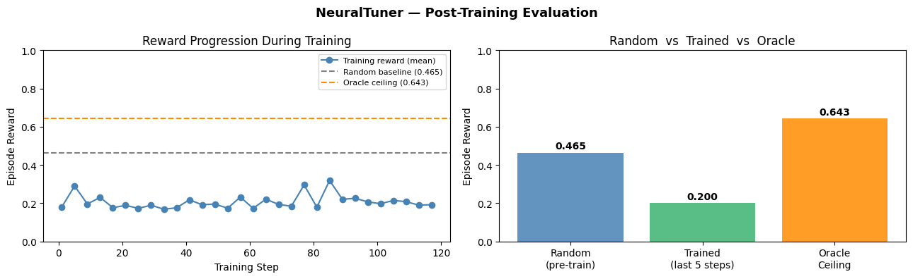
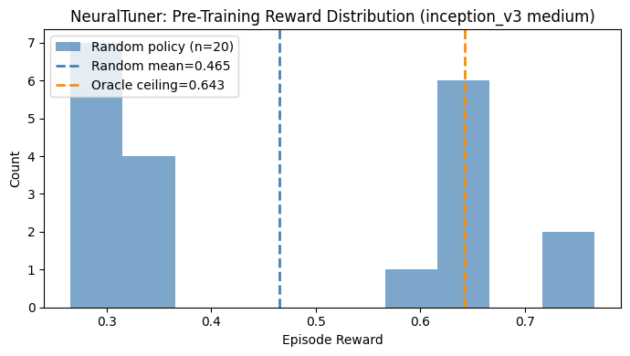

# Neural Tuner Env Environment
# NeuralTuner: Hardware-Aware RL Environment for LLMs
# NeuralTuner: An RL Environment for Hardware-Aware Neural Network Optimization on Snapdragon

> *Teaching an LLM to think like a Qualcomm optimization engineer — one layer at a time.*

**[🤗 Live Demo — HuggingFace Space](https://huggingface.co/spaces/Mohammed-Altaf/Neural-Tuner)**  |  **[📓 Training Notebook](neural_tuner_trl_mac.ipynb)**

---

## The Problem: Manual Model Optimization Is a Bottleneck at Scale

Deploying a neural network to a Qualcomm Snapdragon-powered device — a smartphone, an ADAS ECU, a laptop NPU, an XR headset — is not as simple as exporting a PyTorch model. Every production deployment goes through a hardware-specific optimization pipeline that today relies heavily on expert engineers.

The workflow looks roughly like this:

1. **Profile each layer** to understand its contribution to latency, memory, and its sensitivity to precision reduction.
2. **Decide per-layer quantization** — should this layer stay at FP32, drop to FP16, or be aggressively quantized to INT8 or INT4?
3. **Apply structured pruning** — can we remove entire channels/filters to exploit the Snapdragon HTP's sparse-acceleration hardware?
4. **Validate hardware constraints** — does the resulting model fit within the device's latency budget, memory envelope, and accuracy floor?
5. **Iterate** — if constraints aren't met, revisit decisions and try again.

This cycle is done manually today. For a 50-layer network with 4 quantization options and 4 pruning options per layer, the decision space is **8^50 ≈ 10^45 combinations**. Engineers use intuition and years of hardware experience to navigate this. It takes days to weeks per model, and every new device or model family requires it again from scratch.

**NeuralTuner converts this expert-intensive workflow into a structured RL environment** where a language model learns to act as the optimization engineer — profiling layers, making quantization decisions, validating constraints, and iterating until it finds a configuration that meets all hardware requirements.

---

## Why Snapdragon HTP?

The **Snapdragon HTP (Hexagon Tensor Processor)** is Qualcomm's dedicated AI accelerator present across the Snapdragon 8 Gen series (mobile), Snapdragon X Elite (compute), Snapdragon Ride (automotive), and Snapdragon XR platforms. It has specific hardware support for:

- **INT8 and INT4 computation** — dramatically lower latency than FP32 due to packed SIMD operations
- **Sparse weight acceleration** — hardware-native support for structured pruning; 50% and 75% sparsity maps directly to hardware-accelerated sparse matrix operations
- **Strict memory envelopes** — edge devices have no dynamic memory expansion; models that exceed the budget simply cannot run

Quantization and pruning effects are **not independent**. On HTP hardware, they **stack multiplicatively** on latency and memory — a layer quantized to INT4 and pruned at MEDIUM sparsity (50% channels removed) achieves roughly `0.28 × 0.65 ≈ 18% of baseline latency`. Accuracy penalties, however, **add** rather than multiply — reflecting that both operations independently erode model precision. NeuralTuner's simulator faithfully models both of these hardware behaviors.

---

## Environment Design

**OpenEnv-compatible FastAPI server** with a stateful, multi-step RL episode interface to any LLM agent.

### State Space

At episode start (`reset()`), the agent observes:
- The **model identity** (e.g., ResNet-50) and total parameter count
- The **layer table** — each layer's ID, type, baseline latency (ms), and baseline memory (MB)
- The **Snapdragon HTP constraints** — a hard latency budget, a hard memory budget, and a minimum accuracy retention threshold
- The **scenario description** — a natural-language framing of the deployment context (e.g., "ResNet-50 in an edge inference pipeline with strict memory budget")

Crucially, **layer sensitivity scores are hidden** at episode start. This is a deliberate design choice — it mirrors real hardware profiling workflows (you don't know a layer's sensitivity until you run a calibrated profiling pass) and it forces the agent to develop an information-gathering strategy before making quantization decisions.

### Action Space

The agent has six discrete tool-call actions:

| Action | Arguments | Effect |
|--------|-----------|--------|
| `profile_layer(layer_id)` | layer ID | Reveals sensitivity score (0–1), quantization advice, pruning advice |
| `quantize_layer(layer_id, dtype)` | layer ID + `FP32`/`FP16`/`INT8`/`INT4` | Applies quantization dtype to one layer |
| `prune_layer(layer_id, sparsity)` | layer ID + `LOW`/`MEDIUM`/`HIGH` | Removes 25%/50%/75% of channels (structured pruning) |
| `revert_layer(layer_id)` | layer ID | Resets layer to FP32, no pruning |
| `benchmark()` | — | Runs the hardware simulator; returns latency, memory, accuracy, projected reward |
| `submit()` | — | Finalises the episode; returns the true final reward |

The **benchmark action is rate-limited to 5 calls per episode**. This prevents a degenerate strategy of single-step quantize → benchmark → revert loops and forces the agent to batch decisions and plan ahead — as an engineer would.

### Partial Observability and the Profiling Incentive

The hidden sensitivity design creates a **partially observable MDP**. The agent must decide how many steps to invest in information gathering (`profile_layer`) before committing to compression decisions. Profiling too little risks over-aggressive quantization that destroys accuracy. Profiling everything costs steps that could be used for optimization.

The environment explicitly rewards the profile-first strategy through its reward shaping (detailed below) and by emitting a `WARNING: Layer not profiled` message when the agent quantizes a layer it has not yet profiled — training signal that unprofiled quantization is risky.

### Simulator: Calibrated Hardware Model

`server/simulator.py` implements the hardware model. For each layer, it applies:

```
latency(layer) = base_latency × dtype_latency_factor × prune_latency_factor
memory(layer)  = base_memory  × dtype_memory_factor  × prune_memory_factor
accuracy_penalty(layer) = sensitivity × (dtype_acc_penalty + prune_acc_penalty)
```

The factor tables are calibrated against real Snapdragon HTP profiling data:

| dtype | Latency factor | Memory factor | Acc penalty/sensitivity |
|-------|---------------|--------------|------------------------|
| FP32  | 1.00 | 1.000 | 0.0 |
| FP16  | 0.62 | 0.500 | 0.30 |
| INT8  | 0.42 | 0.250 | 2.0 |
| INT4  | 0.28 | 0.125 | 7.0 |

| Pruning | Latency factor | Memory factor | Acc penalty/sensitivity |
|---------|---------------|--------------|------------------------|
| NONE    | 1.00 | 1.00 | 0.0 |
| LOW     | 0.82 | 0.75 | 0.8 |
| MEDIUM  | 0.65 | 0.50 | 2.5 |
| HIGH    | 0.45 | 0.25 | 6.0 |

Total accuracy retention is computed as:
```
accuracy_retention = clip(1.0 - Σ(layer_penalty) / 100.0, 0.0, 1.0)
```

### Reward Function

The multi-component reward is designed to prevent reward hacking while producing a dense, informative gradient signal:

```
reward = latency_reward + memory_reward + accuracy_reward + efficiency_bonus
```

| Component | Range | Logic |
|-----------|-------|-------|
| Latency improvement | 0.00 – 0.40 | Continuous — proportional to % latency saved vs FP32 baseline |
| Memory constraint | 0.00 or 0.30 | Binary — model must fit within device memory budget |
| Accuracy retention | 0.00 – 0.20 | Continuous — scaled within [min_accuracy, 1.0] range |
| Efficiency bonus | 0.00 or 0.10 | All three constraints met simultaneously |

**Why this structure prevents reward hacking:**
- Blindly applying INT4 to all layers collapses accuracy → accuracy_reward = 0, efficiency_bonus = 0. Total ≈ 0.10.
- Leaving all layers at FP32 gives zero latency improvement → latency_reward = 0. Total ≈ 0.50 (memory fits, accuracy perfect).
- The optimal strategy — selective mixed-precision based on sensitivity — is the only path to reward > 0.80.

### Scenarios: 19 Deployment Challenges

The environment includes 19 scenarios across 5 models and 3 difficulty tiers, each modelling a real-world Snapdragon deployment target:

| Model | Params | Baseline | Domain |
|-------|--------|----------|--------|
| Inception V3 | 47M | 175 ms, 186 MB | Mobile vision analytics |
| ResNet-50 | 25M | 88 ms, 93 MB | ADAS feature backbone |
| MobileNet V3 | 5.4M | 24 ms, 21 MB | IoT / always-on edge |
| GM Perception Net | 58M | 210 ms, 232 MB | Automotive object detection |
| BMW DriveNet | 35M | 145 ms, 140 MB | Autonomous segmentation + depth |

Difficulty scaling:

| Tier | Latency target | Memory target | Min accuracy | Challenge |
|------|---------------|--------------|-------------|-----------|
| Easy | ≤60% baseline | ≤60% baseline | ≥0.85 | Uniform INT8 sufficient |
| Medium | ≤45–50% baseline | ≤45–52% baseline | ≥0.88–0.93 | INT4 required on select layers; protect heads |
| Hard | ≤38–42% baseline | ≤28–40% baseline | ≥0.90–0.95 | Strict mixed-precision; some variants RAM-primary, others accuracy-primary |

---

## Key Technical Terms

### Sensitivity Score
A per-layer float in [0.0, 1.0] that quantifies how much that layer's output degrades when its precision is reduced. Low-sensitivity layers (e.g., early convolutional stems, pooling) tolerate aggressive INT4 quantization with minimal accuracy loss. High-sensitivity layers (classifiers, detection heads, output predictors) degrade rapidly under precision reduction and typically must stay at FP16 or FP32.

Sensitivity scores are **hidden from the agent at episode start** — they must be revealed layer-by-layer using `profile_layer()`. This is the core information asymmetry that makes the task non-trivial.

### Oracle Ceiling
The best reward achievable by a perfect agent that knows all layer sensitivities in advance and makes optimal quantization decisions to satisfy constraints. For the inception_v3 medium scenario: **oracle ceiling = 0.6428**. This is computed offline by running the heuristic policy (profile all → assign dtype by sensitivity threshold → benchmark → submit). The oracle is not the theoretical maximum reward of 1.0 — it represents what a knowledgeable human engineer would achieve, providing a realistic upper bound for RL training.

### Random Baseline
The mean reward of a fully random policy (random action type, random layer, random dtype) averaged over 20 seeds. For inception_v3 medium: **random baseline = 0.465**. Somewhat counter-intuitively, the random baseline is not near zero — the binary memory_reward (0.30) and partial latency improvement from random quantizations push it above chance. The RL agent must meaningfully exceed this to demonstrate genuine policy learning.

### Lift vs Random / Lift vs Oracle
Two derived metrics used to track training progress:
- **Lift vs Random** = eval_reward − random_baseline (how much better than random)
- **Lift vs Oracle** = (eval_reward − random_baseline) / (oracle_ceiling − random_baseline) (% progress from random to oracle)

### Structured Pruning
A compression technique that removes entire channels or filters from convolutional layers (as opposed to unstructured pruning which zeros individual weights). Structured pruning produces dense weight matrices with fewer channels, enabling direct speedup without sparse-format overhead. The Snapdragon HTP has dedicated hardware for sparse workloads — structured pruning at MEDIUM (50%) or HIGH (75%) sparsity maps directly to accelerated execution paths on-chip.

---

## What the Agent Must Learn: Random vs Expert Episode Traces

The trained agent's target behavior — the strategy that earns high reward — is clearly visible by comparing a random agent to a heuristic agent on the same scenario:

### Random Agent (reward: 0.30)
```
Step 1:  quantize_layer(conv_stem, FP32)   → WARNING: Layer not profiled
Step 2:  quantize_layer(conv_bn_1, FP32)   → WARNING: Layer not profiled
Step 3:  quantize_layer(mixed_3a, INT8)    → WARNING: Layer not profiled
...
Step 11: benchmark()
Step 12: submit()                          → reward = 0.3037, constraints_met = False
```

The random agent never profiles. It applies dtypes without knowledge of sensitivity, frequently leaves high-sensitivity layers under-protected and low-sensitivity layers under-compressed simultaneously.

### Heuristic Agent (reward: 0.64 — oracle ceiling)
```
Step 1:  profile_layer(conv_stem)          → sensitivity=0.040 [low risk — INT4 safe]
Step 2:  profile_layer(conv_bn_1)          → sensitivity=0.020 [low risk — INT4 safe]
Step 3:  profile_layer(mixed_3a)           → sensitivity=0.080 [low risk]
Step 4:  profile_layer(mixed_4a)           → sensitivity=0.120 [medium risk — INT8 preferred]
Step 5:  profile_layer(mixed_5a)           → sensitivity=0.090 [low risk]
Step 6:  profile_layer(mixed_6a)           → sensitivity=0.150 [medium risk]
Step 7:  quantize_layer(conv_stem, INT4)
Step 8:  quantize_layer(conv_bn_1, INT4)
Step 9:  quantize_layer(mixed_3a, INT4)
Step 10: quantize_layer(mixed_4a, INT8)    ← protects medium-sensitivity layer
Step 11: quantize_layer(mixed_5a, INT4)
Step 12: quantize_layer(mixed_6a, INT8)    ← protects medium-sensitivity layer
Step 13: benchmark()
Step 14: submit()                          → reward = 0.6428, constraints_met = False
```

The heuristic agent profiles first, builds a sensitivity map, then assigns dtypes proportional to each layer's risk tolerance. The RL agent's goal is to learn this pattern from reward signals alone — without being told the strategy.

---

## Training Pipeline

```
┌─────────────────────────────────────────────────────────────────┐
│                         Training Pipeline                        │
│                                                                  │
│  Base LLM (Qwen-2.5-0.5B-Instruct)                             │
│       │                                                          │
│       ▼                                                          │
│  SFT Warm-up  ──  heuristic trajectories  ──  20 steps, LoRA   │
│       │                                                          │
│       ▼                                                          │
│  GRPO Training                                                   │
│    • Curriculum: easy → medium → hard                           │
│    • num_generations = 4  (4 rollouts per prompt)               │
│    • max_steps = 120  (training steps)                          │
│    • num_iterations = 1  (μ parameter — inner update passes)    │
│    • eval every 30 steps on 5 held-out scenarios                │
│    • W&B logging: reward, lift_vs_random, lift_vs_oracle        │
│       │                                                          │
│       ▼                                                          │
│  Trained LoRA checkpoint → inference.py → 19 scenarios         │
└─────────────────────────────────────────────────────────────────┘
```

### Baseline Metrics (pre-training)

| Metric | Value |
|--------|-------|
| Random policy reward (mean, n=20) | 0.465 |
| Random policy reward (std) | 0.188 |
| Oracle ceiling (heuristic) | 0.643 |
| Lift from random → oracle | 0.178 |

### Training Results


*GRPO training reward trajectory vs random baseline (0.465) and oracle ceiling (0.643)*


*Pre-training random policy reward distribution — inception_v3 medium, n=20 seeds*

---

## Future Work and Live Hardware Integration

The current NeuralTuner simulates hardware behavior through calibrated factor tables. The natural next step is to close the loop with **real on-device measurement** — and to expand the action surface from simulation to live deployment.

### On-Device Inference Validation (Android / Windows / Automotive / XR)

Snapdragon SoCs run across four distinct runtime environments, each with its own SDK and profiling toolchain:

| Platform | SDK | Use case |
|----------|-----|---------|
| Android (Snapdragon 8 Gen 4) | Qualcomm AI Engine Direct (QNN) | Mobile vision, on-device LLMs |
| Windows (Snapdragon X Elite) | QNN Windows SDK + DirectML | Copilot+ PC workloads |
| Automotive (Snapdragon Ride) | Snapdragon Ride SDK | ADAS, Autonomous Driving (SAE L2–L4) |
| XR (Snapdragon XR2 Gen 2) | Snapdragon Spaces SDK | Mixed reality, spatial computing |

A live integration would compile the agent's quantization/pruning plan to a QNN `.dlc` (Deep Learning Container) file using the **Qualcomm AI Model Efficiency Toolkit (AIMET)**, deploy it to the target device via ADB (Android) or appropriate device bridge, run inference, and collect hardware telemetry back into the RL environment as real reward signal.

### Real Hardware Telemetry as RL Signal

Several hardware-side measurements that currently exist as separate engineering tools would feed directly into NeuralTuner as additional reward components and environment observations:

**DLBC — Deep Learning Bandwidth Compression**
DLBC is Qualcomm's on-chip weight compression scheme that further reduces DRAM bandwidth for quantized models. Post-deployment, DLBC compression ratio is measurable via the QNN profiling SDK. A model that achieves high DLBC ratio in addition to meeting latency/memory constraints indicates an especially hardware-friendly quantization plan — this can be added as a bonus reward term.

**SWC — Sparse Weight Compression**
SWC measures how efficiently the structured pruning maps to the HTP's sparse matrix hardware. After deploying a pruned model, the HTP reports the effective sparsity utilization — a pruning configuration that achieves HIGH sparsity without triggering HTP sparsity format mismatches gives a higher SWC ratio. This provides direct feedback on whether the agent's pruning decisions are exploiting the hardware correctly.

**Sysmon Logs**
Qualcomm's System Monitor (`sysmon`) captures real-time SoC telemetry: DSP/CPU/GPU utilization, DRAM bandwidth, thermal throttle events, and power consumption in milliwatts. Sysmon data would let the reward function penalize thermal-bound configurations (where the model technically meets latency targets in isolation but causes thermal throttling under sustained load) and reward power-efficient configurations that stay within thermal design power (TDP) budgets.

**FARF Logs (Fast and Reliable Filtering)**
FARF is Qualcomm's internal debug logging framework used on the Hexagon DSP. FARF logs capture DSP-side execution traces including HTP execution time per layer, DMA transfer overhead, and any precision fallbacks (where the HTP silently promotes INT4 ops to INT8 due to hardware limitations). This data would allow NeuralTuner to detect and penalize plans that look good in simulation but trigger precision promotion on real hardware — a critical gap between the current simulator and real deployment.

**Power Configuration Logs**
Power profiling logs capture voltage/frequency scaling decisions made by the Snapdragon Power Management IC (PMIC) during model inference. A quantization plan that keeps the device in a lower DVFS (Dynamic Voltage and Frequency Scaling) bin achieves equivalent performance at lower power — a property the current simulator cannot capture but that is highly relevant for battery-operated devices.

### Closed-Loop RL Architecture (Future Vision)

```
┌──────────────────────────────────────────────────────────────────┐
│                   Live Hardware RL Loop                           │
│                                                                   │
│  LLM Agent                                                        │
│     │  tool calls                                                 │
│     ▼                                                             │
│  NeuralTuner Env  ──► AIMET compile  ──► QNN .dlc               │
│     ▲                                        │                    │
│     │  reward signal                         ▼                    │
│     │                               Snapdragon device             │
│     │                                  (Android/Auto/XR)         │
│     │                                        │                    │
│     └──── sysmon + FARF + DLBC + SWC ◄──────┘                   │
│           (real latency, power, sparsity utilization)            │
└──────────────────────────────────────────────────────────────────┘
```

This architecture would make NeuralTuner the first RL environment where LLM-driven optimization decisions are validated by — and trained against — real SoC telemetry rather than a surrogate simulator. The RL agent would learn not just to satisfy constraint budgets on paper, but to produce configurations that are genuinely efficient on Snapdragon silicon.

---

## Repository Structure

```
NeuralTuner/
├── server/
│   ├── app.py                          # FastAPI server (OpenEnv runtime)
│   ├── neural_tuner_env_environment.py # RL environment logic
│   ├── simulator.py                    # Hardware simulator (latency/memory/accuracy model)
│   ├── scenarios.py                    # 19 scenarios across 5 models × 3 difficulties
│   └── model_zoo.py                    # Layer profiles for 5 neural networks
├── scripts/
│   ├── neural_tuner.py                 # OpenEnv TRL wrapper (NeuralTunerOpenEnv)
│   └── run_training_eval.py            # Post-training evaluation sweep
├── neural_tuner_trl_mac.ipynb          # Full training notebook (SFT warmup + GRPO)
├── inference.py                        # Multi-scenario inference runner (HF router)
├── rollout_eval.py                     # Baseline vs heuristic episode evaluation
├── models.py                           # Pydantic action/observation models
├── client.py                           # OpenEnv WebSocket client
├── openenv.yaml                        # OpenEnv deployment manifest
└── tests/                             # pytest suite (reward sanity, env flow, schema)
```

---

## Quick Start

```bash
# Install
uv sync

# Run the environment server
uvicorn server.app:app --reload --host 0.0.0.0 --port 8000

# Run inference across all 19 scenarios using HF router
HF_TOKEN=hf_... python inference.py

# Run a specific scenario
HF_TOKEN=hf_... python inference.py --scenario mobilenet_v3_easy

# Run only medium-difficulty scenarios
HF_TOKEN=hf_... python inference.py --difficulty medium

# Generate random vs heuristic baseline comparison
python rollout_eval.py --trace --model-id inception_v3 --difficulty medium

# Run tests
pytest -q
```

---

## OpenEnv Deployment

The environment is packaged as an OpenEnv space with a FastAPI runtime:

```yaml
# openenv.yaml
spec_version: 1
name: neural_tuner_env
type: space
runtime: fastapi
app: server.app:app
port: 8000
```

Push to Hugging Face:

```bash
git push space master
```

---

## Tests

```bash
pytest -q
```

Current test suite covers:
- Reward sanity: safe vs over-aggressive quantization produces expected reward ordering
- Budget enforcement: benchmark limit (5/episode) and step limit (20/episode)
- Invalid layer handling: unknown layer IDs, missing dtype/sparsity arguments
- Terminal state: submit() terminates episode; subsequent steps return episode_complete
- Training metrics schema: eval_metrics.json structure validation
